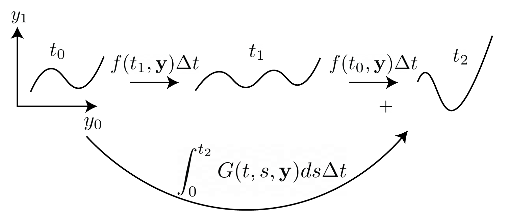
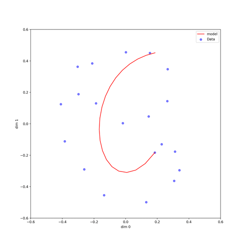

# Neural IDE

Pytorch implementation of the Neural Integro-Differential Equations (NIDE)



If you use NIDE or any part of it in your own work, please cite [Zappala et al](https://arxiv.org/abs/2206.14282):
```
@article{zappala2022neural,
  title={Neural integro-differential equations},
  author={Zappala, Emanuele and Fonseca, Antonio Henrique de Oliveira and Moberly, Andrew Henry and Higley, Michael James and Abdallah, Chadi and Cardin, Jessica and van Dijk, David},
  journal={arXiv preprint arXiv:2206.14282},
  year={2022}
}
```

## Table of Contents
- [Quick start](#quickstart)
- [Datasets](#datasets)
- [Tutorial](#tutorial)
- [Manual Environment Creation](#manual-environment-creation)

## Quickstart
Clone this repository locally:

```
git clone https://github.com/emazap7/Neural_IDE.git
```


Create an Anaconda environment from the `environment.yml` file using:

```
conda env create --file environment.yml
conda activate neural_ide
```

## Datasets

The toy data has been obtained by solving analytical IDEs in 2D and 4Ds. The kernels used in both cases were convolutional kernels where the entries were given by combinations of trigonometric functions. The F function was a hyperbolic cosine. To obtain the datasets, we have randomly sampled initial conditions and solved the corresponding initial value problem for the IDEs, using our implementation of the IDE solver. The integrals have been performed with Monte-Carlo integration with 1K sampled points per interval, and the number of iterations used was set to 10, which was empirically seen to guarantee convergence to the solution.

The scripts for the toy data generation can be found [here](resources/NIDE_method_github.png).

## Tutorial
For an example on how to use NIDE to model dynamics, consult this [notebook](nide_spirals_example.ipynb) in which NIDE is used to model the toy dataset described above. The animation below illustrates the fitting process for the 2D curve.




## Manual Environment Creation
If the `environment.yml` file does not successfully recreate the environment for you, you can follow the below steps to install the major packages needed for this project:

1. Create and activate an anaconda environment with Python version 3.8:
```
conda create -n neural_ide python=3.8
conda activate neural_ide
```

2. Install Pytorch: `conda install pytorch==1.12.0 torchvision==0.13.0 cudatoolkit=11.3 -c pytorch`

3. Install Matplotlib: `conda install -c conda-forge matplotlib`

4. Install `pip install git+https://github.com/patrick-kidger/torchcubicspline.git`

5. Install `conda install -c anaconda scipy`

6. Install `conda install -c conda-forge torchdiffeq`

7. Install `conda install -c conda-forge tqdm`

8. Install `conda install -c anaconda scikit-learn`


